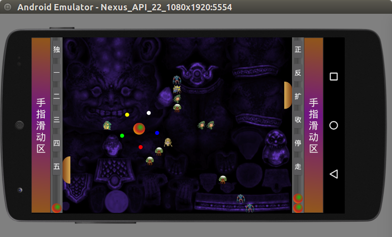

## 碰块---Bound
#### 假如你正好看到这个项目,但这仅是一个安卓游戏开发练习上手项目,代码比较混战,所以你不要这样做,如果你对它比较感兴趣可以Fork它.
#### 写了两关,如果你有兴趣可以去扩关数,但需要注意:
1. 关数原始图片资源放在assets里新建一个你自已的文件夹.
2. 然后在gates文件夹里新建你的关数类去extends GateDraw类.
3. 把你的关数类导入到BoundActivity,在此类需做如下:

>       Class[] cls = new Class[]{
>                    One.class,    // 第一关小图件布局
>                    Two.class     // 每二关小图件布局
>                    // 这里加上你写的关数
>                    你的关数.class  // 加上你写的关数   
>             };

#### 下面是一些游戏场景图:

  
  

> #### 下面是一个已打包的.apk
> 你可以点[这儿](https://raw.githubusercontent.com/granau/Bound/master/app/release/app-release.apk)去下载安装

